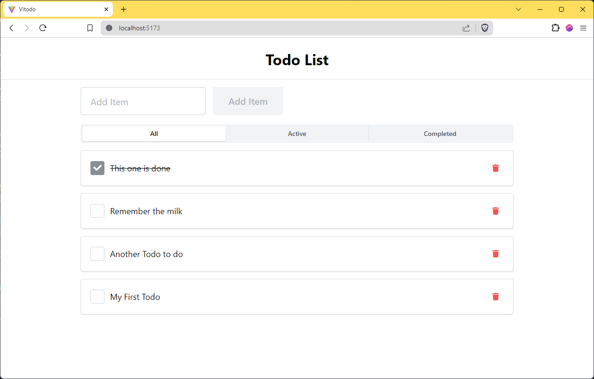

# Todo Test

A simple todo list

## Tech Stack

- Vite
- Supabase (for REST API demo)
- Mantine
- Redux Toolkit

## Running Locally

Install dependency with `yarn`, `npm`, or `pnpm`. Example with yarn:

```sh
yarn
```

Run local server:

```sh
yarn dev
```

## Screenshot


